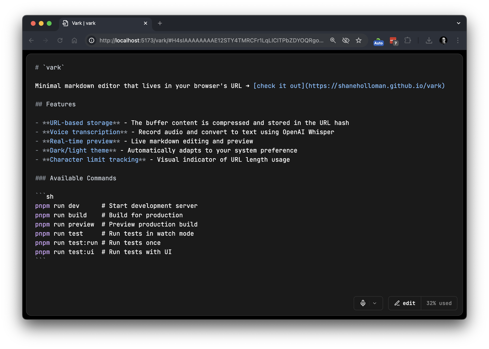

# `vark`

Minimal markdown editor that lives in your browser's URL ➜ [check it out](https://shaneholloman.github.io/vark)



## Features

- **URL-based storage** - The buffer content is compressed and stored in the URL hash
- **Voice transcription** - Record audio and convert to text using OpenAI Whisper
- **Real-time preview** - Live markdown editing and preview
- **Dark/light theme** - Automatically adapts to your system preference
- **Character limit tracking** - Visual indicator of URL length usage

## Development

This project uses PNPM for package management.

### Setup

```sh
pnpm install
```

### Available Commands

```sh
pnpm run dev      # Start development server
pnpm run build    # Build for production
pnpm run preview  # Preview production build
pnpm run test     # Run tests in watch mode
pnpm run test:run # Run tests once
pnpm run test:ui  # Run tests with UI
```

## Testing

This project uses Vitest with React Testing Library for a fast, modern testing experience.

### Testing Stack

- **Vitest**: Fast unit test framework built on Vite
- **@testing-library/react**: React component testing utilities
- **@testing-library/jest-dom**: Custom DOM matchers
- **@testing-library/user-event**: User interaction simulation
- **jsdom**: Browser environment simulation

### Project Structure

```tree
src/
├── components/
│   ├── editor.tsx    # Main editor component
│   ├── recorder.tsx  # Voice recording component
│   └── icon.tsx      # App icon component
├── test/
│   ├── setup.ts      # Test setup and global mocks
│   ├── editor.test.tsx # Main component tests
│   └── utils.test.ts # Utility function tests
├── main.tsx          # App entry point
├── style.css         # Global styles
└── vite-env.d.ts     # Vite type definitions
```

## Keyboard Shortcuts

- **Cmd + Enter**: Start/stop recording
- **Cmd + e**: Toggle editor/split/view mode
- for md shorcuts, see [react-md-editor](https://uiwjs.github.io/react-md-editor/)
